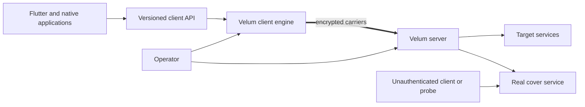
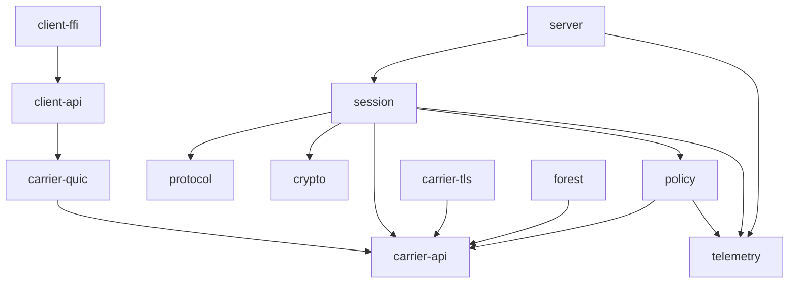
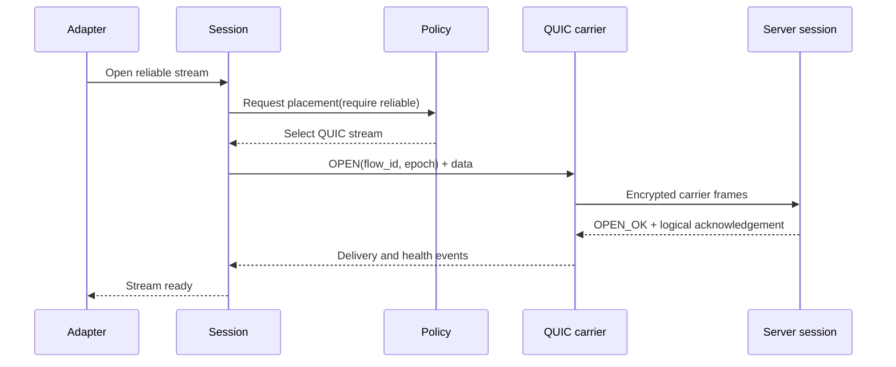
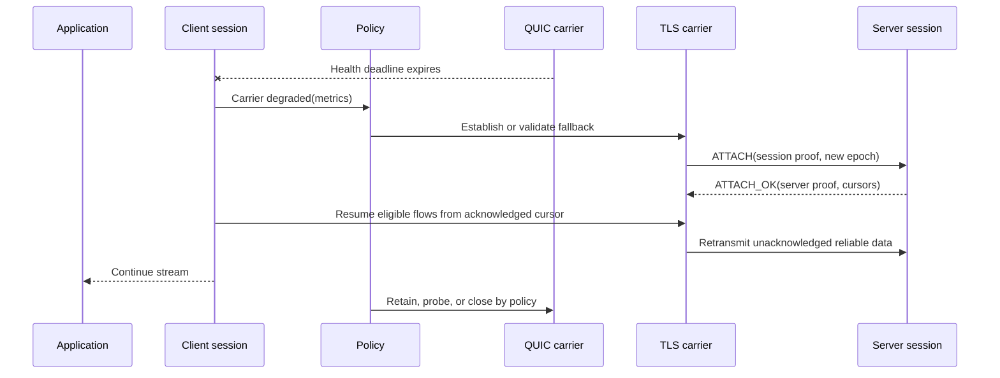

# Proposed Architecture

Status: Proposed. This document defines responsibility boundaries, not a frozen
wire format or crate layout.

## Context



The client and server are separate trust domains connected through an
untrusted network. Local applications trust the client to route their traffic.
Targets see the server as the network peer. The cover service must remain a
real service even when the Velum protocol is disabled.

## Responsibility Boundaries

| Module | Owns | Must not own |
|---|---|---|
| `client-api` | Direct in-process client sessions and stream backpressure | Local proxy listeners, session keys, server routing policy |
| `client-ffi` | Flutter native ABI and opaque-handle validation | QUIC lifecycle, credential parsing, protocol state, or payload retention |
| `protocol` | Frame encoding, decoding, version negotiation, and state-machine types | Sockets, timers, cryptographic implementations, routing decisions |
| `session` | Logical session and flow identity, ordering, acknowledgements needed for migration, replay invariants | Network I/O details or camouflage behavior |
| `carrier-api` | Narrow contract for opening, sending, receiving, health reporting, and closing carriers | QUIC- or TLS-specific code |
| `carrier-quic` | QUIC connection, streams, datagrams, path MTU, transport telemetry | Global carrier policy or application classification |
| `carrier-tls` | TLS/TCP connection, framing, stream scheduling, and transport telemetry | Pretending unreliable delivery exists over TCP |
| `policy` | Carrier scoring, transition thresholds, hysteresis, and flow placement | Direct socket access, session mutation, or ownership of delivery state |
| `forest` | Cover-service routing, pre-auth behavior, optional traffic profiles, probe tests | Authentication truth, session correctness, or cryptography |
| `crypto` | Session authentication, key derivation, replay windows, secret lifecycle | TLS implementation or policy decisions |
| `server` | Authentication entry point, destination authorization, outbound sockets, quotas | Client-side path selection |
| `telemetry` | Structured events, metrics vocabulary, redaction | Secrets, payloads, destination names by default |

The final crate names may differ. The ownership and dependency direction are
load-bearing.

## Allowed Dependency Direction



Forbidden dependencies include:

- `protocol` importing any runtime, socket, carrier, or policy module;
- carrier implementations importing each other;
- `forest` changing authentication results or session state;
- `policy` importing `session`, parsing wire frames, or reading application
  payloads;
- telemetry becoming a source of truth for session correctness.

`session` passes immutable flow requirements and carrier-health snapshots to
`policy`. Policy returns a recommendation; only `session` may apply it and
advance protocol state.

## Protocol Layers

```text
Application adapter
  Logical flow: stream | datagram [| message later]
Session protocol
  identity, flow IDs, replay rules, transition epochs, control frames
Carrier contract
  reliable stream and/or unreliable datagram capabilities, health signals
Transport security
  QUIC/TLS 1.3 using reviewed libraries
Network
  UDP or TCP
```

A session is not a transport connection. It may attach multiple carriers over
its lifetime. A carrier belongs to exactly one authenticated logical session in
v1; sharing a carrier across users is out of scope.

## Key State and Write Authority

| State | Write authority | Persistence |
|---|---|---|
| Session identity and epoch | Session state machine | Memory; resumable token only if later specified |
| Flow lifecycle and delivery cursor | Session state machine | Memory |
| Carrier liveness and measurements | Owning carrier | Memory; exported as telemetry |
| Carrier selection | Policy engine | Memory; decision events retained by operator policy |
| Credentials and server authorization | Operator configuration / authentication backend | External configuration; never telemetry |
| Traffic profile | Forest profile configuration | Versioned configuration |
| Cover content | Cover application | Independent of Velum session state |

No two modules may advance a flow's delivery cursor. Carrier acknowledgements
are evidence consumed by `session`; they are not the source of logical delivery
truth.

## Runtime: Normal Path



The QUIC carrier is preferred when its health and capability satisfy policy.
TLS/TCP is not opened merely because it exists; warm-fallback policy must be
explicit due to idle and battery cost.

## Runtime: UDP Black Hole and Transition



The state machine must tolerate duplicated reliable data around the transition
without exposing duplication to the application. Unreliable datagrams are not
replayed by default; transition loss is explicit and measurable.

## Failure Semantics

| Failure | Required behavior |
|---|---|
| Authentication failure | Do not create a session; route through ordinary cover-service behavior without a protocol-specific oracle |
| One carrier stalls | Mark degraded after policy threshold; try an existing authenticated carrier before opening another |
| All carriers fail | Close flows with one stable reason; do not wait indefinitely |
| Duplicate/reordered control frame | State machine rejects, ignores, or idempotently applies it according to frame contract |
| Replay of carrier attach | Reject outside the session replay window and emit a redacted security event |
| Oversized datagram | Return an explicit local error or drop according to negotiated semantics; never silently convert it to reliable delivery |
| Server overload | Reject new sessions or flows before damaging established-flow correctness; apply per-principal quotas |
| Policy engine crash/error | Use a deterministic conservative policy; it may not mutate protocol cursors |
| Forest profile error | Disable the profile and continue correct transport behavior; camouflage must not corrupt the session |

## Compatibility Policy

- The wire protocol begins with an explicit version and capability negotiation.
- Unknown optional frames are ignored only when their encoding explicitly marks
  them as ignorable.
- Unknown mandatory frames close the affected session with a stable error.
- A peer may decline a capability without pretending to provide its semantics.
- Breaking changes require a new major wire version and an ADR.
- Compatibility shims require an owner, removal condition, and test.

## Security Boundaries

- Carrier TLS protects transport hops; session authentication binds every
  carrier to one logical session.
- Carrier attachment requires fresh proof and is replay protected.
- Destination access is denied by default for loopback, link-local, multicast,
  broadcast, and operator-blocked ranges unless explicitly allowed.
- The server enforces authentication, destination policy, quotas, and outbound
  source validation.
- Secrets and payloads are never logged. Destination metadata is opt-in and
  redacted by default.
- No production security claim is allowed before a written protocol, threat
  model, test vectors, fuzzing, and independent review exist.

## Observability

Every carrier decision must emit a structured event containing:

- session-local pseudonymous ID;
- old and new carrier types;
- reason code and policy version;
- relevant RTT, loss, timeout, and path state;
- transition duration and outcome;
- affected flow counts by semantics, not destination.

Payloads, credentials, raw session tokens, and full destinations are forbidden.
