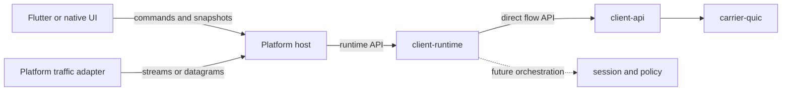

# Client Architecture Evolution

Status: Proposed. This document defines the target client ownership boundaries
and a reversible migration from the experimental Flutter direct-client slice.
It does not claim production VPN support. Restorable desktop system proxy and
Android TUN ownership are defined by
[ADR-0016](adr/0016-restorable-platform-traffic-adapters.md).

## Decision Summary

Velum will introduce `velum-client-runtime` as the single write authority for
client connection lifecycle, runtime status, and access to active flows.
Flutter and future native user interfaces will issue control commands and
render runtime snapshots; they will not infer transport health or own packet
I/O. Platform network hosts will integrate operating-system lifecycle and
traffic adapters with the runtime through narrow Rust and control APIs.

The implemented migration uses ABI v2 over the existing Stage 2 QUIC data
path:

```text
Flutter -> client-ffi -> client-runtime -> client-api -> QUIC relay
```

The current slice also installs restorable desktop proxy settings and a
configurable Android-owned IPv4 TUN service. Desktop proxy flows apply the
strict first-match local routing policy defined by
[ADR-0017](adr/0017-local-traffic-routing-policy.md). Android TUN rule parity
remains deferred. The slice does not yet introduce automatic reconnection,
desktop TUN helpers, or a stable external control protocol.

Runtime control ABI v2 returns a stopped runtime handle before network work
begins, accepts start and stop commands without waiting for a network timeout,
and exposes fixed-width latest-value snapshots. ABI v1 was retired during the
internal test phase because the v2 configuration layout adds an explicit trust
mode.

## Goals

- Give connection state, cancellation, and active-client ownership one source
  of truth below the presentation layer.
- Keep presentation, platform lifecycle, traffic integration, transport, and
  protocol policy in separately enforceable modules.
- Reuse one Rust runtime across supported platforms while allowing each
  platform to use its required service or extension lifecycle.
- Keep credentials, payloads, and destinations out of UI diagnostics and
  control-plane telemetry.
- Deliver the migration as tested end-to-end slices with explicit rollback
  conditions.

## Non-Goals

- Claiming production platform support before retained device and desktop
  lifecycle evidence passes.
- Adding desktop TUN behind Android's lifecycle contract; each desktop helper
  needs its own privilege, installation, and rollback decision.
- Defining every platform API or release entitlement in this proposal.
- Moving session correctness, carrier selection, or server authorization into
  the UI or platform host.
- Replacing the experimental Stage 2 wire record in this migration.

## Evidence Ledger

### Verified Facts

- Flutter binds runtime ABI v2 lifecycle commands and latest-value snapshots.
  It selects platform traffic modes but neither packet payloads nor direct
  stream/datagram handles cross the Flutter boundary.
- `velum-client-api` deliberately provides direct streams and datagrams without
  a local proxy listener.
- The Flutter project contains runners for Linux, macOS, Windows, and Android,
  plus an Android `VpnService`; it has no iOS runner or desktop VPN helper.
- Flutter currently reads credential and certificate files before calling the
  native ABI.
- `cargo xtask architecture`, the client crate tests, and the current Flutter
  widget test pass, but no Flutter-to-relay live-flow test exists.

### Assumptions

- A shared Rust lifecycle runtime reduces platform-specific state divergence.
  Invalidate this if a supported platform cannot host the runtime within its
  required lifecycle or resource limits.
- A control-plane-only UI boundary is compatible with the desired user
  experience. Invalidate this if a required workflow needs payload processing
  in Flutter.
- Internal-test consumers can rebuild whenever a fixed C layout changes; a
  released ABI requires a versioned migration plan before that change lands.

### Unknowns

- ADR-0016 selects and wires the Android TUN adapter through `VpnService`, a
  native fd pump, and a maintained userspace TCP/UDP stack. Retained Android
  device evidence across lifecycle and network-change cases remains unresolved.
- The first supported release platform and its signing, entitlement, service,
  installation, and background-execution requirements.
- Required reconnect latency, startup latency, idle resource, and mobile wakeup
  budgets; these require retained workload measurements.
- The stable control protocol used between a platform host and Flutter.

## Ranked Architecture Drivers

1. **Traffic and lifecycle correctness.** UI state must never claim service
   after the runtime has stopped or a newer operation supersedes an older one.
2. **Security boundary.** Secrets and packet data stay below the presentation
   and diagnostic boundaries.
3. **Cross-platform lifecycle fit.** Platform-specific service and extension
   requirements must not leak into transport or session policy.
4. **Maintainability.** Dependencies, ownership, and compatibility paths are
   machine checked.
5. **Evolution speed.** The existing Stage 2 path remains testable while one
   responsibility is migrated at a time.

Correctness and security win over UI reuse or compatibility. Platform-specific
hosts are preferred over a false single-process abstraction when the operating
system requires a separate lifecycle or privilege boundary.

## Quality Scenarios

| Quality | Stimulus and environment | Expected response | Evidence |
|---|---|---|---|
| Lifecycle correctness | Disconnect supersedes an in-flight connect | A late connect result is discarded and cannot restore `Online` | Deterministic runtime state tests |
| State consistency | Any accepted state transition | Snapshot revision increases and subscribers observe the same latest state | Runtime unit tests |
| Dependency integrity | A crate imports outside its declared boundary | CI fails with a specific forbidden dependency | `cargo xtask architecture` |
| ABI evolution | ABI v2 consumers provide the documented trust mode and fixed layouts | Native and Flutter ABI tests reject mismatched versions before configuration is read | Client FFI and Flutter tests |
| Secret isolation | A status or failure is emitted | No credential, certificate bytes, payload, or destination is present | Typed payload-free errors plus review |
| Platform support | A platform is declared supported | Install, connect, route a retained workload, suspend/resume, and uninstall all pass | Platform release gate, not yet implemented |

Numeric latency and resource budgets remain uncalibrated until retained
measurements exist. They are not copied from unrelated products.

## Options Considered

| Option | Strength | Accepted downside or rejection reason |
|---|---|---|
| Add features directly to the current Flutter `StatefulWidget` | Fastest visible UI progress | Rejected: leaves lifecycle, secrets, and traffic ownership in presentation code |
| Keep Flutter-to-Rust synchronous FFI as the permanent boundary | One process and few deployment units | Rejected as the target: blocking calls and OS background lifecycles do not form a portable control boundary |
| Shared Rust runtime with platform hosts and a control-plane UI | Coherent state ownership and platform lifecycle fit | Selected: adds a host/control contract and platform-specific packaging work |

## Target Module View



### Ownership Boundaries

| Module | Owns | Must not own |
|---|---|---|
| UI | User intent, navigation, forms, and rendering snapshots | Connection truth, credentials, packet I/O, retries, or transport handles |
| Platform host | OS service/extension lifecycle, permission integration, secure configuration references, and control endpoint | Protocol state, carrier policy, or UI navigation |
| Platform adapter | OS traffic capture and conversion to bounded runtime flow operations | Relay authentication, reconnect policy, or UI state |
| `client-runtime` | Lifecycle state, operation generations, managed connection and closure observation, active client ownership, and runtime snapshots | UI concerns, OS APIs, wire codecs, or server authorization |
| `client-api` | Direct authenticated QUIC connection, independently owned stream halves, datagrams, and backpressure | OS traffic capture, presentation, or global lifecycle policy |
| `client-ffi` | ABI v2 fixed-layout control adaptation, cancellable stream calls, and opaque runtime-handle validation | Lifecycle truth, credential storage, or transport behavior |

Dependencies point inward from platform integration to runtime contracts.
`client-ffi` may depend on `client-runtime`, and `client-runtime` may depend on
`client-api` and telemetry. UI and platform modules may not import carrier or
protocol internals.

## Lifecycle Contract

The runtime publishes immutable snapshots with a monotonically increasing
revision and one of these initial states:

```text
Stopped -> Connecting -> Online -> Stopping -> Stopped
                        \-> Failed
Connecting --disconnect/supersede--> Stopping or Stopped
```

`Degraded` and `Reconnecting` will be added only with live carrier-health and
retry policy ownership. The UI must not synthesize either state.

Invariants:

- At most one active client is owned by one runtime instance.
- Every lifecycle operation receives a generation; a completion from an older
  generation cannot change state or install a client.
- `Online` means the current start generation owns an authenticated transport.
  A payload-free QUIC closure signal moves that same generation to `Failed`.
  It never means that a system traffic adapter is installed or routing.
- `Stopped` owns no active client. Native adapters must invalidate any flow
  handles derived from the previous client generation.
- Failures are stable, payload-free categories. Diagnostic text is derived at
  the presentation edge and never contains secret inputs.
- The runtime owns the in-flight connection task. Stop aborts it before
  publishing `Stopped` and joins it before the stop command returns; dropping
  the runtime aborts any remaining task instead of detaching it.

## Native Control ABI

Runtime ABI v2 is identified by `velum_client_runtime_abi_version() == 2`.
Its lifecycle entry points are:

| Function | Contract |
|---|---|
| `velum_client_runtime_create` | Allocate one stopped runtime and return its opaque handle. |
| `velum_client_runtime_start_v1` | Copy and validate configuration, publish `Connecting`, start native work, return its generation, and return without waiting for the network result. |
| `velum_client_runtime_snapshot_v1` | Copy the latest immutable snapshot without waiting for a transition. |
| `velum_client_runtime_stop` | Invalidate derived stream handles, supersede and abort in-flight connection work, close the active client, end `Stopped`, join the task before returning, and return the current generation. |
| `velum_client_runtime_proxy_start_v2` | Copy and validate ordered routing rules, bind a loopback HTTP CONNECT/SOCKS listener, and return its selected port. |
| `velum_client_runtime_destroy` | Atomically retire the runtime handle, perform stop cleanup, and reject all later calls with `InvalidHandle`. |

`VelumRuntimeSnapshotV1` is a C-layout value containing `u64 revision`, `u64
generation`, `u32 phase`, and `u32 failure`; no Rust enum layout crosses the
boundary. Phase values are `Stopped=0`, `Connecting=1`, `Online=2`,
`Stopping=3`, and `Failed=4`. Failure value zero means none; nonzero values are
the stable payload-free failure categories already exposed by the direct
client. New values may be appended but existing numeric meanings do not
change within runtime ABI v2. Control-call status is a separate fixed `i32`
contract: `Ok=0`, `InvalidArgument=1`, `InvalidHandle=2`, `Configuration=3`,
`Certificate=4`, `Busy=5`, and `Internal=6`. Asynchronous connection failures
are published in snapshots instead of being returned by start.

Commands for one handle are linearized at the native boundary. A start either
returns after its generation is visibly `Connecting` or returns an error; a
concurrent stop or destroy cannot allow that generation to become `Online`
later. Start is non-blocking with respect to network establishment. Stop may
wait only for local task cancellation and resource release, never for the
configured network timeout.

An asynchronous flow open captures its runtime generation. The FFI adapter may
publish the resulting stream handle only after revalidating that the same
generation remains `Online` while holding the per-runtime command lock. Stop
invalidates all stream handles for that runtime before it returns.

Reliable send and receive halves have independent ownership and locks. A
blocked read therefore cannot prevent a write or finish. Closing a stream,
stopping its runtime, or destroying its runtime broadcasts cancellation to
in-progress native reads and writes; those calls return a transport status and
do not keep an invalidated handle alive indefinitely.

## Data Ownership

| Datum | Write authority | Persistence and exposure |
|---|---|---|
| Runtime state and revision | `client-runtime` | Memory; payload-free snapshots to control consumers |
| Active client and flow handles | `client-runtime` / `client-api` | Memory only; opaque outside the native boundary |
| Profile metadata | Platform host configuration store | Versioned local configuration; UI reads redacted values |
| Credential material | Future platform secure-storage integration | UI receives an opaque reference only; current ABI v2 is a migration exception |
| Carrier health | Owning carrier, later consumed by runtime/session policy | Memory and redacted telemetry |
| Traffic counters | Runtime/adapter from actual I/O | Aggregated, bounded, and destination-free |

## Failure And Recovery

| Failure | Required behavior |
|---|---|
| Connect timeout or authentication failure | Publish `Failed` with a stable category and retain no active client |
| Authenticated QUIC connection closes | Publish `Failed` for the current generation and retire its active client |
| Disconnect during connect | Supersede the operation; close any late client result and end `Stopped` |
| UI process exits | Platform host follows the selected platform policy; the UI is not the state authority |
| Platform host exits | OS traffic adapter is removed or fails closed; stale UI snapshots are invalidated on reconnect |
| Control consumer is slow | It may skip intermediate snapshots and must receive the latest revision without blocking data-plane work |
| Runtime invariant fails | Fail closed, release traffic integration, and emit a payload-free diagnostic event |

Automatic reconnect, backoff, and carrier transition are deliberately deferred
until the runtime is wired to live health evidence and `velum-session` policy.

## Security And Operations

- The UI/control protocol must never carry packet payloads or raw credentials
  in the target architecture.
- Platform hosts run with the minimum privileges required by their traffic
  adapter and expose control endpoints only to the local authenticated user.
- Logs and snapshots exclude payloads, credentials, raw session tokens, and
  full destinations.
- Every supported platform requires an install, upgrade, rollback, permission,
  suspend/resume, network-change, and uninstall test before release support is
  claimed.
- A platform host crash must fail closed and must not leave routes or firewall
  rules installed without an owned recovery procedure.

## Maintainability Contract

The machine-readable rules live in `architecture-contract.yaml`:

- `client-runtime` is owned by client maintainers and may depend only on
  `client-api` and telemetry in the initial slice.
- `client-ffi` may depend only on `client-runtime` after migration.
- platform adapters depend on a narrow runtime/session API and telemetry, never
  on carrier implementations or UI modules.
- dependency cycles, forbidden dependencies, unowned governed files, and
  unowned modules remain zero-tolerance gates.
- Fixed-layout ABI changes require a version increment, consumer migration
  note, and native binding test through architecture review; the current
  validator does not yet enforce this field.

The existing `applications` declaration governs all `apps/**` paths and is too
broad to enforce the future platform-host boundary. Before a Rust platform host
is added, split that declaration into `node-application` and `client-host`; the
latter may depend only on `client-runtime`, telemetry, and the selected narrow
adapter contract. ADR presence, state write authority, risk, and compatibility
metadata remain human-review checks until `xtask` gains explicit validators.

Executable gates:

```text
cargo xtask architecture
cargo test -p velum-client-runtime -p velum-client-ffi
cargo clippy --workspace --all-targets -- -D warnings
cargo fmt --all --check
cargo xtask docs
```

Platform integration and resource budgets become blocking only after their
reference environments and thresholds are recorded.

## Evolution Plan

### Completed Migration

- Added `velum-client-runtime` and route ABI v2 connect, close, and stream
  operations through it. The direct datagram API remains available to future
  native adapters without claiming Flutter support for datagrams.
- Retired ABI v1 during internal testing when ABI v2 added trust-mode layout.
- Gate on deterministic lifecycle tests, current client tests, architecture,
  formatting, lint, and docs checks.
- Roll back by removing the runtime wrapper and restoring `client-ffi`'s direct
  `client-api` dependency.

### Slice 2: Asynchronous Control Contract

- Added runtime ABI v2 with create, non-blocking start, latest-value snapshot,
  stop, and destroy commands.
- Make `client-runtime` own and cancel its connection task. Move Flutter's
  connection state authority below the UI and prove that a late connect cannot
  override stop or disposal.
- Use snapshot polling in the in-process Flutter host. Event
  subscription remains a future platform-control-protocol choice.
- Roll back by disabling the runtime control entry points and retaining direct
  native stream operations.

### Slice 3: One Real Traffic Adapter

- Implemented restorable system proxy paths for Windows, macOS, and supported
  Linux desktops, plus an Android IPv4 TUN path for TCP, UDP, and DNS.
- Added a platform-aware traffic mode controller so routing intent activates
  only against an online runtime and OS integration is removed before stop.
- Retain live relay workload, route cleanup, failure containment,
  suspend/resume, and network-change evidence before claiming support.
- Roll back by removing the adapter and leaving direct application flows intact.

### Slice 4: Platform Expansion

- Add one platform host at a time with an explicit support matrix and release
  evidence.
- Move credential material into platform secure storage before claiming support.
- Require every shipped consumer to pass ABI v2 control and live-flow gates
  before declaring platform support.

## Invalidation And Review Triggers

Revisit this architecture if a supported platform cannot host the shared Rust
runtime within measured resource limits, if a maintained platform-native
transport removes the need for the shared runtime without duplicating protocol
policy, or if evidence shows that application-specific integration is more
valuable than system traffic routing.

## Open Decisions

- Production traffic adapter and first target platform.
- Platform control transport and authentication mechanism.
- Secure-storage schema, rotation, import, and recovery behavior.
- Reconnect, degraded-state, and carrier-transition thresholds.
- Calibrated startup, transition, memory, idle-byte, and battery budgets.

## Profile And Desktop TUN Evolution

ADR-0018 and ADR-0019 add the next feature-gated client boundaries:

- `velum-client-profile` strictly validates and normalizes Velum-owned YAML v1
  without admitting inline credentials or CA material;
- `velum-client-routing` owns the shared dual-stack matcher and action meaning
  consumed by proxy and TUN adapters;
- `velum-client-engine` composes independent single-node runtimes behind one
  profile generation and isolates lazy node failures;
- `velum-helper-protocol` and `velum-desktop-traffic-host` own bounded helper
  messages, idempotency, mutation journaling, and mandatory crash recovery.

The Flutter client imports profiles through native ABI v3 and persists only a
canonical managed copy. Credential and CA references resolve through platform
secure storage. ABI v2 runtime control remains available during migration.

The shared TUN core now classifies IPv4 and IPv6 TCP/UDP, encodes dual-stack
UDP responses, retains bounded fake-IP DNS identity by profile generation, and
evaluates the shared policy after restoring the real destination. Android
passes its configured MTU through ABI v2 rather than using a native constant.

Desktop TUN remains disabled in ordinary builds. A build must explicitly set
`VELUM_EXPERIMENTAL_DESKTOP_TUN` and provide the authenticated platform channel
implemented by the signed Windows service, Linux polkit service, or macOS
Packet Tunnel system extension. No platform is release-supported until the
installation, upgrade, recovery, network-change, and uninstall evidence in
ADR-0018 is retained for all three desktop targets.
